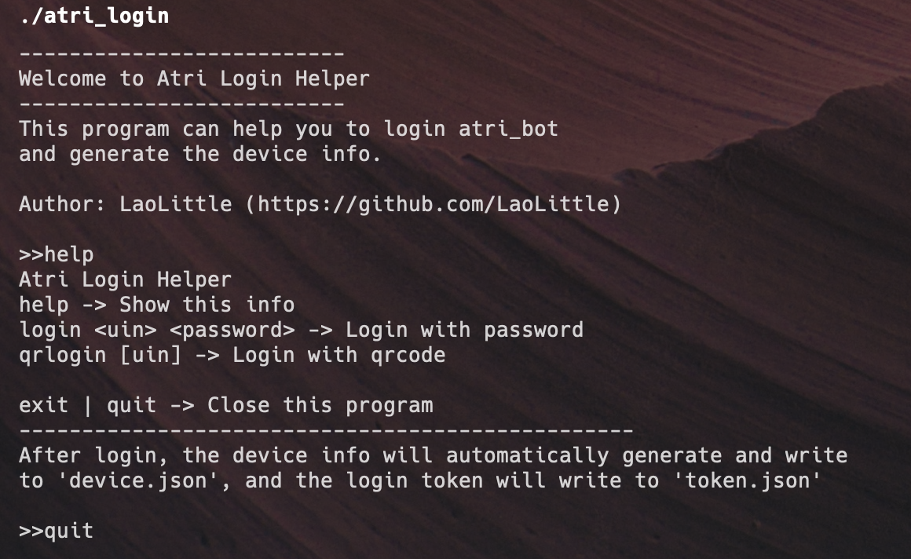

# 登录

前往[AtriLogin-Release](https://github.com/AtriKawaii/atri_login/releases)
获取AtriLogin

打开后输入`qrlogin`即可进行二维码登录, 手机QQ扫码即可

二维码将直接显示在控制台, 若你所使用的终端不支持Unicode(e.g. Windows CMD), 
请直接打开同目录下的`qr.png`二维码图片进行扫码

登录后会在同目录下生成以你所登录的QQ号命名的文件夹, 将此文件夹拖入`atri_bot/bots`目录内即可

::: warn 注意
请不要随意修改内部的设备信息等文件
:::
